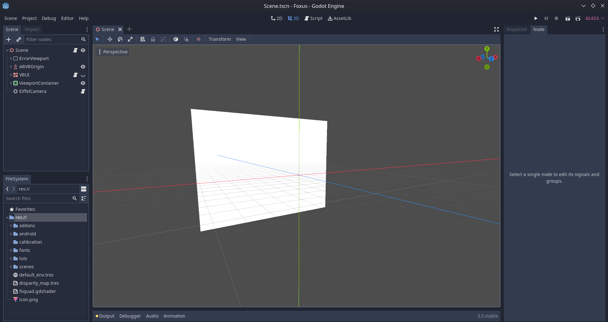

Creator Tutorials
===================================

.. note::

   Here be dragons! More tutorials are coming soon. 

   If you have ideas for tutorials or something to contribute, we'd love to hear from you.

These tutorials are aimed at users new to the Foxus Creator system, with a brand new project that contains nothing but the Foxus camera setup.

If you've never used Godot before, that's OK. We'll quickly run through the different parts of the Foxus project that you'll see when you open it. Otherwise, feel free to skip ahead to one of the more specific tutorials in this section.

When you open the Foxus project in the editor, you'll be greeted with the 3D Scene view. In the center of the screen, there's not much to look at -- you'll see a white quad (a quadrilaterial polygon) floating in a grey void. This quad is where we display the feed from the Foxus cameras.

*It will probably look something like this.*

Check out the left-hand side of the screen and you can see the Scene hierarchy, which contains nested objects called nodes. The top level of this hierarchy is a node called the Scene, and represents the whole project. Inside of the Scene node are a variety of other nodes, two of which are quite important:

* ARVROrigin -- this represents the headset wearer's position. Any nodes which are placed inside of (parented to) the ARVROrigin will stick to the user's field of vision, and move with their head.
* ViewportContainer is the node that contains the menu you can access by pressing B inside of the app. This includes options, LUTs, calibration information, etc. You shouldn't need to mess around with this, but it's there. 

Clicking a node in the Scene hierarchy on the left will open more detailed information on the right-hand side of the screen. This will be very useful later. 

In addition to that 3D view in the center of the screen, you can click on the tabs above it to switch to a few other views: 2D view (which will show you the user interface), Script (which will let you explore code on individual nodes in more detail) and AssetLib (which you can use to download or import outside assets).

Finally, in the lower-left of the screen, you'll see the FileSystem area. This shows all folders and files in your project, including those which are not currently in the Scene hierarchy.

There's a lot more to explore in Godot, but for now, this is all you need to know about the basic anatomy of the project. 

.. toctree::
   tutorials/*
   :hidden: