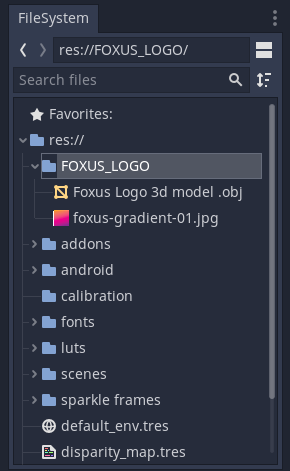
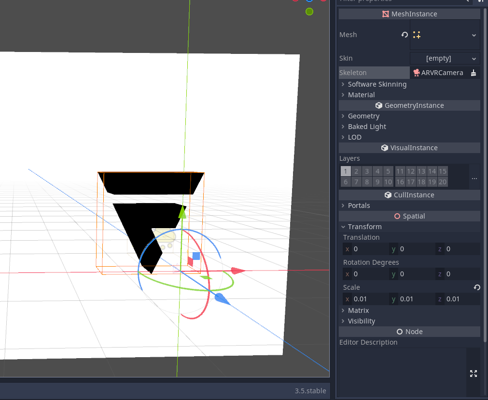
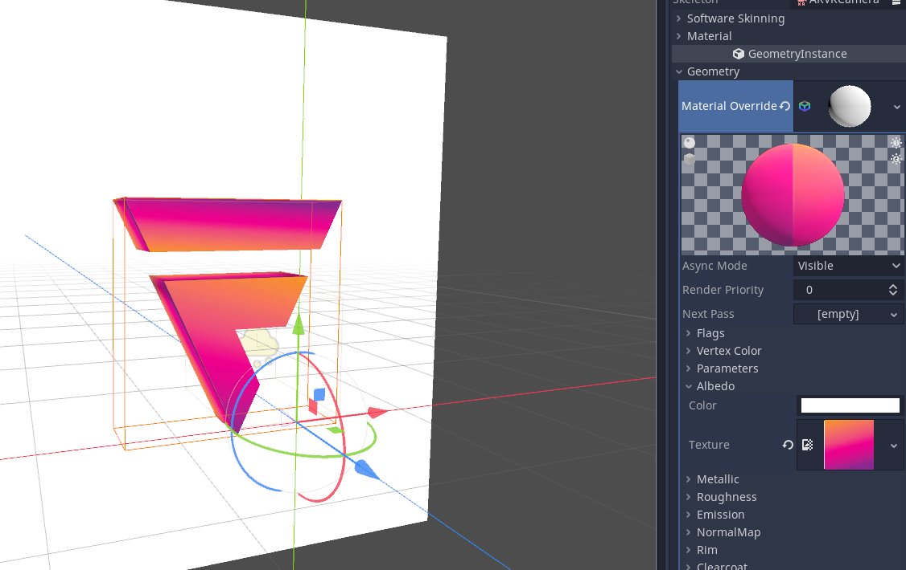
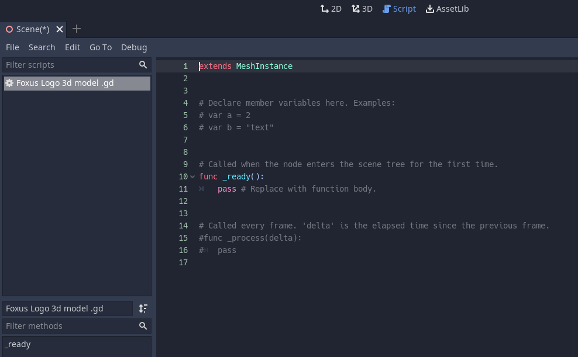

Importing 3D Models
===================================

.. note::

   Here be dragons! 
   
   Positioning of 3D models in a mixed reality space is not an exact science.

   Just placing an object in Godot will not anchor it to a "real" position in space.

   Moving your head, or moving within the space, may move 3D objects in unexpected ways. 

   This problem could likely be solved with the use of pose estimation tools like `ArUco markers <https://docs.opencv.org/4.x/d5/dae/tutorial_aruco_detection.html>`_.

If you've made a 3D model in an external program, or downloaded one you can use, you can probably import it into the Foxus view. Check the `Godot documentation <https://docs.godotengine.org/en/stable/tutorials/assets_pipeline/importing_scenes.html>`_ to find a list of accepted formats. For now, since we're keeping things as simple as possible, we'll be using a .obj file of the Foxus logo, with a simple gradient as its texture. You can download this file, and the texture it uses as an image, below.

`Foxus Logo 3D Model.obj </_static/FOXUS_LOGO/Foxus Logo 3d model .obj>`_

`foxus-gradient-01.jpg </_static/FOXUS_LOGO/foxus-gradient-01.jpg>`_

You can drag these directly into the Foxus project folder, or tuck them inside of a sub-folder to keep things more organized. Either way, they will be visible inside of the FileSystem tab inside of Godot:

*Not all file types are visible in this view, but these are.*

Dragging our new .obj file into the 3D Scene View in the center of the screen, or into the Scene hierarchy in the top left, will add it to the scene. However, you won't immediately be able to see it. This model is very large, so we'll need to reduce its scale. 

Find the *Foxus Logo 3d model* object in the Scene hierarchy and click on it. You can adjust various properties for it on the right-hand side of the screen, under the Inspector tab. 

*I've set the model's scale along all three axes to 0.01 here.*

This model has heaps of possible surfaces you can apply textures to, but let's apply the gradient to all of them indiscriminately using the Material Override option, under "GeometryInstance". 

*After that, it's as easy as loading in our gradient to the Albedo texture of this material.*

This looks neat, but because of the way 3D objects are anchored in the Quest's viewport, we won't get to view it from all angles like this. To compensate for this, let's add a simple script to this logo that makes it spin around by itself. Right-click the *Foxus Logo 3d model* object in the Scene hierarchy and select *Attach script*. You can leave all of the values to default in the small window that appears and create your new script. 

*If you've never looked at the Script view before, it may be intimidating, but we won't be doing anything frightening.*

We'll be replacing this dummy script with a very simple one. 

.. code-block:: GDScript

    extends MeshInstance

    # This is the rotation speed of our object, in degrees per second.
    # 360 degrees is a full revolution each second. -360 spins the other direction.
    var speed = 10

    # Called every frame. 'delta' is the elapsed time since the previous frame.
    func _process(delta):
        # rotate_object_local rotates the object in local space.
        # The first argument we pass here (that strange Vector3) is just telling it
        # to rotate along the Y axis. 
        # Then, multiply the time elapsed since the last frame, with our speed,
        # which we turn into "radians" before applying them to the rotation.
        rotate_object_local(Vector3(0, 1, 0),delta * deg2rad(speed))

Finally, as with our particle emitter tutorial, we should position this logo somewhere in space where we can definitely see it in the headset. I've dragged it inside of the *ARVRCamera* node, inside of *ARVROrigin*, so that it moves with my head. Then, in the same Spatial section where I scaled the model, I've given it a Transform position of *5, -5, -30*. 

.. raw:: html

   

   <video width="640" height="480" controls>
      <source src="_static/logo.mp4" type="video/mp4">
      Your browser does not support the video tag.
   </video> 
   

    