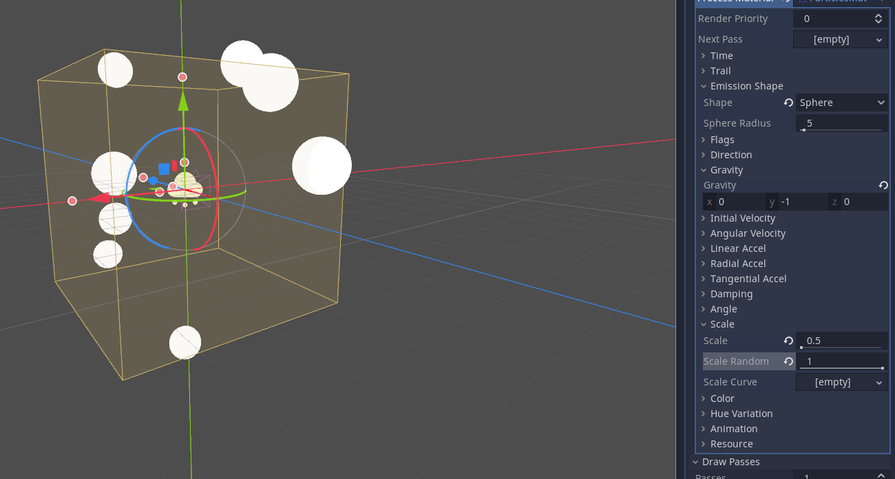

Particle Systems
===================================

Godot has a system for creating particle effects, which we can easily use in Foxus to great effect. 

After you open the project, check the left side of the screen to see the Scene hierarchy. Directly below the tab that reads "Scene" is a + button. You can click this, or hit CTRL-A, to create a new node within your scene. 

You'll be given heaps of options in the new window that appears, but just type in "Particles" and it will give you fewer to choose from. 

.. image:: _static/particles1.png
   :align: center

*A filtered view of the New Node window.*

CPUParticles and the regular Particles type (which is rendered with the GPU) will have different performance on different devices. For now, let's go with the regular one. You can hit the "Create" button to add it to your scene. You'll now be able to see it in the Scene hierarchy to the left, with some warnings attached.

*Check warnings by hovering your mouse over the yellow alert symbol.*

If you click on this node, more information will open up on the right side of the screen. Use the tabs at the top of this column to change from the "Node" view to the "Inspector" view. You may have noticed our warnings referred to missing *draw pass* meshes and *process materials*, so we'll be adding them here. You can click on these headings in the Inspector to expand them.

*There's nothing there, but we can fix that.*

By clicking on the entries reading [empty] we can assign new materials and meshes to them. In the Process Material heading, I've selected "New ParticlesMaterial", and in the Draw Passes heading I've selected "New SphereMesh" -- what happens next?

*The particle emitter is now pushing out endless Sphere Meshes.*

If you're looking to create spheres or other simple shapes, this might be good enough. Right now, the spheres are only being fired downwards, like a machine gun. In the new Particle Material we've created (you may have to click on it to expand and edit it), open the heading for "Emission Shape." By default, this is set to a single point, which is why our spheres are all appearing at the same location. We can change the Emission Shape to a sphere, too, and increase the radius, to give a more organic falling particle effect.

*Of course, you can experiment with other emission shapes and their sizes.*

Let's say I want to create some particles inspired by the `bokeh effect <https://en.wikipedia.org/wiki/Bokeh>`_ -- gently falling balls of semi-transparent light. There's a few things I'll want to change here. 

First, my bokeh are falling too quickly. If I open the "Gravity" sub-heading, I can see that by default a force of -9.8 is being applied to these particles along the green, vertical y axis. Changing this value to -1 makes them fall slower (and positive values would reverse their gravity). 

It would be nice if the bokeh orbs were a little smaller, and if they weren't all exactly the same size. The "Scale" subheading lets me change both these values. I'll change "Scale" to 0.5, and "Scale Random" to 1, to give a lot of variation.

*We're getting closer to something pretty.*

I'm satisfied with the way my particles are being emitted now. I'd like to work on the particles themselves instead. If I click on my new sphere mesh inside of Draw Passes, I can expand it and edit its qualities. I need to give it its own material to change things like its color and translucency. You'll see a section that says Material is currently [empty], so click on it and select "New SpatialMaterial" so we can change some of its values. 

Since I'm making bokeh, I already know a few things about how I want this new material to behave. Open the "Flags" heading. Let's check "Transparent" (so that it can render transparency on our bokeh orbs) and "Unshaded" (since they're balls of light, we don't want them to receive any sort of shading themselves). Next, open the "Albedo" heading and we can directly change its color here. I'll go for a nice, warm orange. I'll also use the "Alpha" slider to make it a bit transparent. 

*If you're familiar with hexadecimal color codes, this orange is #fab000 -- isn't that fabulous?*

There's one more really important thing we have to do to make sure our bokeh will show up nicely in the Foxus view... position the particle emitter! 

*This section is coming soon. Stay tuned!*